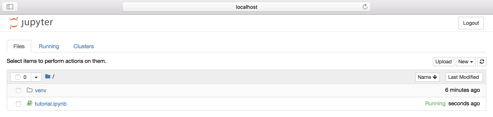

# Installing the tutorial prerequisites

The library for auditing models is written in Python 3, and the
tutorial will be using Jupyter Notebooks. In this page, we will go
over the instructions on how to install both the `BlackBoxAuditing`
library and Jupyter.

This document assumes that you're using Unix of some kind (Linux or
macOS).

## Virtual Environments

In order to simplify package installation, for this tutorial we highly
recommend that you use a fresh virtual environment, so that there's no
risk of conflicting package versions, etc. Let's first create a new
directory, and create a virtual environment inside it:

    $ mkdir auditing-tutorial
	$ cd auditing-tutorial
    $ python3 -m venv venv
	$ . ./venv/bin/activate
    (venv) $

The `(venv)` prompt in your shell indicates that the shell is running
in a "virtual environment": new python library installs will be
isolated from the rest of your system, so you don't risk overwriting
anything by accident. Let's install the library now:

    (venv) $ pip3 install BlackBoxAuditing
    Collecting BlackBoxAuditing
      Downloading BlackBoxAuditing-0.1.35.tar.gz (2.6MB)
    (.. lots more stuff like this)

    Installing collected packages: decorator, networkx, pyparsing, pytz, six, python-dateutil, numpy, cycler, matplotlib, joblib, future, CommonMark, bottleneck, scipy, urllib3, idna, chardet, certifi, re    quests, serverfiles, AnyQt, docutils, scikit-learn, keyrings.alt, pyqtgraph, xlrd, setuptools, keyring, Orange3, BlackBoxAuditing
    (...)
    Successfully installed AnyQt-0.0.8 BlackBoxAuditing-0.1.35 ...
	
Success! Let's make sure it runs:

	(venv) $ python3
    Python 3.6.3 (default, Oct  4 2017, 06:09:38)
    [GCC 4.2.1 Compatible Apple LLVM 9.0.0 (clang-900.0.37)] on darwin
    Type "help", "copyright", "credits" or "license" for more information.
		>>> import BlackBoxAuditing	
    >>> exit()
	
Ok! Now let's install the [Jupyter notebook](http://jupyter.readthedocs.io/) package:

	(venv) $ pip3 install jupyter
    Collecting jupyter
      Downloading jupyter-1.0.0-py2.py3-none-any.whl
    Collecting qtconsole (from jupyter)
      Downloading qtconsole-4.3.1-py2.py3-none-any.whl (108kB)	

    Successfully installed MarkupSafe-1.0 ...
	
We're almost there. Now, download the [actual notebook file we'll be
using in this tutorial](tutorial.ipynb) into the
`auditing-tutorial` directory, and start the Jupyter notebook
application itself:

    (venv) $ curl -O https://algofairness.github.io/fatconference-2018-auditing-tutorial/tutorial.ipynb
	(venv) $ jupyter notebook
    [I 20:13:17.382 NotebookApp] Writing notebook server cookie secret to ...
    [I 20:13:17.705 NotebookApp] Serving notebooks from local directory: ...
    [I 20:13:17.705 NotebookApp] 0 active kernels
    [I 20:13:17.705 NotebookApp] The Jupyter Notebook is running at:
    [I 20:13:17.705 NotebookApp] http://localhost:8888/...
	
At this point, your browser should automatically be redirected to a webpage that will look like this:

 

click on "tutorial.ipynb" and it will send you directly to the Jupyter
notebook where you'll be able to run our examples. We also have [more documentation on how to run the examples on this notebook](running.html).
